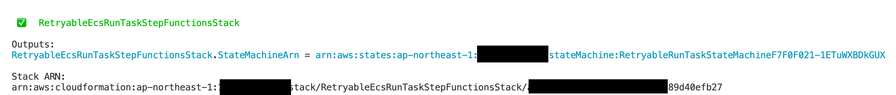
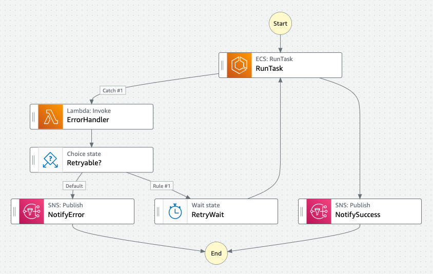

# Retryable ECS Run Task with Step Functions CDK Sample
[](https://github.com/aws-samples/retryable-ecs-run-task-step-functions/actions/workflows/build.yml)

This is a sample Step Functions CDK Construct for ECS Run Task, which automatically retries Run Task step when ECS or your application returns a retryable error.

## Overview
Practically, ECS RunTask sometimes fails due to temporary errors such as `ResourceInitializationError` or `CannotPullContainerError` ([Stopped tasks error codes](https://docs.aws.amazon.com/AmazonECS/latest/userguide/stopped-task-error-codes.html)).

Becuase these errors are not returned synchronously when you call RunTask API, you must check the task result after starting a task.
And if any retryable errors are found, you might want to retry the task again.

This sample shows how to easily automate the above process with Step Functions. (See [How it works](#how-it-works) section)

We'll cover how you can deploy and use them in the following sections first.

**NOTE**: This sample's architecture is for demonstration purpose only. You might need further investigation for errors or stopped reasons and revision of error handler code.


## Deploy
Before deploying this sample, you must install AWS Cloud Development Kit prerequisites. [Please refer to this document](https://docs.aws.amazon.com/cdk/latest/guide/getting_started.html) for the detailed instruction. Make sure you've successfully completed `cdk bootstrap` step.

After that, clone this repository and `cd` to its root directory.

You must first install Node.js dependencies for CDK code by the following commands:

```sh
npm ci
```

Now you can deploy this sample's stack by the following command:

```sh
npx cdk deploy --require-approval never
```

Initial deployment usually takes about 5 minutes.

After a successful deployment, you can check the ARN for Step Functions statemachine.


## Usage
To see how this Step Functions state machine works, you can execute it with the following AWS CLI command:

```sh
aws stepfunctions start-execution --state-machine-arn STATE_MACHINE_ARN
```

Please replace `STATE_MACHINE_ARN` with the actual ARN you can see when you deploy the CDK stack.

ECS errors don't happen very frequently, which makes it difficult to test the behavior.
For testing purpose, we also regard exit code `2` from application as a retryable error, so you can test error handling behavior by modifying application code. (See [`app/main.py`](app/main.py))

## How it works
The below image is a diagram for our Step Functions state machine.



First, it executes ECS RunTask with `Run a Job` integration pattern (see [Service Integration Patterns](https://docs.aws.amazon.com/step-functions/latest/dg/connect-to-resource.html)). In this way, Step Functions automatically waits until a task finishes, and then returns the task result including stopped reasons or container exit code.

If there isn't any errors, it just notify success to Amazon SNS.
If an error happens, we invoke a Lambda function to handle errors. It does the following tasks:

1. Determine if the error is retryable or not. It checks stopped Reasons and application exit code.
2. Calculate current retry count and how long does it wait before next retry using exponential backoff algorithm.

If the error is retryable and current retry count is below the limit, it executes ECS RunTask again.
Otherwise it regards the error is fatal and notify it to Amazon SNS.

You can specify maximum retry count in [`RetryableRunTaskProps`](lib/construct/retryable-run-task.ts).

## Clean up
To avoid incurring future charges, clean up the resources you created.

You can remove all the AWS resources deployed by this sample running the following command:

```sh
npx cdk destroy --force
```

## Security

See [CONTRIBUTING](CONTRIBUTING.md#security-issue-notifications) for more information.

## License

This library is licensed under the MIT-0 License. See the LICENSE file.
